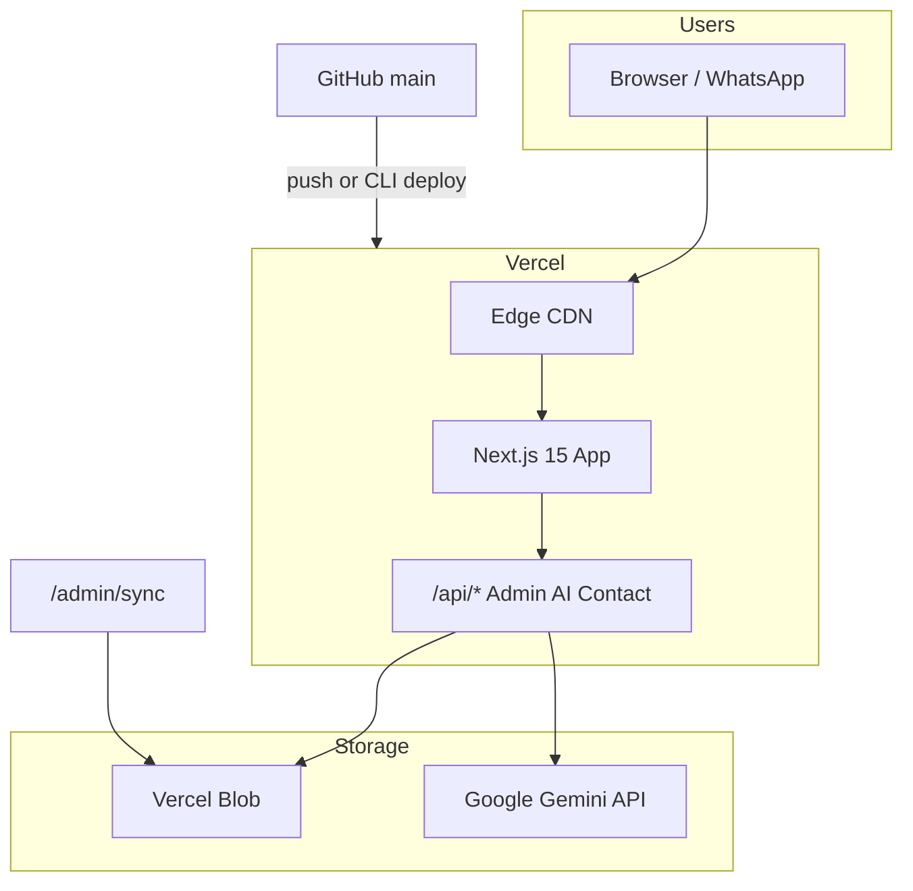

# JUNUBA Vercel 배포 기획

**목표:** `https://www.junubadiesel.com` 에 Next.js 앱 프로덕션 배포  
**저장소:** [JunubaDiesel/JunubaDiesel](https://github.com/JunubaDiesel/JunubaDiesel) (`main`)  
**현재 도메인:** Squarespace (DNS 전환 필요)

---

## 1. 아키텍처



| 구성 | 역할 |
|------|------|
| Vercel Hosting | SSR/ISR, API Routes, middleware |
| Vercel Blob | `inventory.json`, `resources.json`, `oem-guides.json`, 영상/이미지 |
| Google Gemini | AI 채팅, Admin 인사이트 |
| Resend (선택) | 문의 폼 이메일 |
| Upstash (선택) | 프로덕션 rate limit |

---

## 2. 배포 경로 (2가지)

### A. CLI (권장 — 지금 진행)

```powershell
cd "c:\Users\RYZEN  5 7000\Pictures\Junuba"
.\scripts\vercel-login-and-deploy.ps1   # login 5분 대기 후 자동 deploy
# 또는
npx vercel login
.\scripts\deploy-production.ps1
.\scripts\verify-production.ps1
```

`VERCEL_TOKEN`을 `.env.local`에 넣으면 OAuth 없이 `deploy-production.ps1`만 실행 가능 (Vercel → Account → Tokens).

스크립트가 자동 처리:
- `vercel link` (프로젝트 연결)
- env vars (`ADMIN_PASSWORD` 자동 생성, `.env.local`에서 Gemini 키)
- `vercel deploy --prod`
- 도메인 등록 시도 (`www` + apex)

### B. Dashboard Import

1. [vercel.com/new](https://vercel.com/new) → **Continue with GitHub**
2. `JunubaDiesel/JunubaDiesel`, branch **`main`**
3. Environment Variables 설정 (아래 §3)
4. Deploy

---

## 3. 필수 Environment Variables (Production)

| 변수 | 필수 | 설명 |
|------|------|------|
| `ADMIN_PASSWORD` | **예** | `/admin/*` Basic Auth |
| `GOOGLE_GENERATIVE_AI_API_KEY` | 권장 | AI 채팅·Admin |
| `BLOB_READ_WRITE_TOKEN` | **운영 권장** | Admin sync 영구 저장 |
| `RESEND_API_KEY` | 선택 | 문의 폼 (없으면 WhatsApp) |
| `UPSTASH_REDIS_REST_URL/TOKEN` | 선택 | 분산 rate limit |

Blob 생성: Vercel → Project → **Storage → Blob** → 토큰 복사 → env 추가 → **Redeploy**

---

## 4. 도메인 · DNS (Squarespace)

**MX 레코드(Google Workspace `ventas@`)는 변경하지 않습니다.**

| Host | Type | Value |
|------|------|-------|
| `@` | A | `76.76.21.21` |
| `www` | CNAME | `cname.vercel-dns.com` |

Vercel → Settings → Domains:
1. `www.junubadiesel.com` — **Primary**
2. `junubadiesel.com` — apex → www **301 redirect**

코드 canonical: `https://www.junubadiesel.com` ([`src/config/site.ts`](../src/config/site.ts))

---

## 5. 배포 후 운영 (1회 + 일상)

### 5-1. 최초 1회

| 순서 | 작업 | 방법 |
|------|------|------|
| 1 | 재고 동기화 | `/admin/sync` — Excel 업로드 |
| 2 | 영상/리소스 | Blob 업로드 또는 `/admin/resources` |
| 3 | OEM 티저 | `/admin/oem-guides` |
| 4 | DNS 전파 확인 | `.\scripts\verify-production.ps1` |

### 5-2. 일상 업데이트

| 내용 | redeploy 필요? |
|------|----------------|
| 재고 Excel | **아니오** (Blob + Admin) |
| 영상/리소스 | **아니오** (Blob + Admin) |
| 랜딩 문구·전화번호 | **예** (`site.ts` → git push) |

상세: [`content-operations.md`](content-operations.md)

---

## 6. 검증 체크리스트

| # | 항목 | 기대 결과 |
|---|------|-----------|
| 1 | `https://www.junubadiesel.com/` | 200, Server: Vercel |
| 2 | `https://junubadiesel.com/` | 301 → www |
| 3 | `/catalog` | 308 → `/contact` |
| 4 | `/admin/sync` | 401 (Basic Auth) |
| 5 | `/parts` | 재고 목록 |
| 6 | AI 채팅 위젯 | Gemini 응답 |
| 7 | `ventas@junubadiesel.com` | 메일 수신 정상 (MX 미변경) |

---

## 7. 리스크 · 대응

| 리스크 | 대응 |
|--------|------|
| Vercel GitHub 연동 실패 | **Continue with GitHub** 가입, Org `JunubaDiesel` 접근 승인 |
| Workflow 검증 오류 | `main` 최신 사용 (`deploy-vercel.yml` secrets-if 수정됨) |
| Squarespace 계속 표시 | DNS A/CNAME 변경 후 1~24h 대기 |
| Admin sync 데이터 유실 | `BLOB_READ_WRITE_TOKEN` 설정 후 sync |
| Gemini 키 노출 | [AI Studio](https://aistudio.google.com/apikey)에서 재발급 |

---

## 8. 타임라인 (예상)

| 단계 | 소요 |
|------|------|
| Vercel login + CLI deploy | 10~15분 |
| Blob + env + redeploy | 5분 |
| DNS 변경 | 5분 |
| DNS 전파 + SSL | 30분~24h |
| 초기 재고 sync | 10분 |

**총:** 당일 사이트 오픈 가능 (DNS 전파 제외)

---

## 9. GitHub Actions (선택)

`.github/workflows/deploy-vercel.yml` — 수동 실행(`workflow_dispatch`)  
사전 조건: GitHub Secrets에 `VERCEL_TOKEN`, `VERCEL_ORG_ID`, `VERCEL_PROJECT_ID`

일반 운영은 **Vercel Git push auto-deploy** 또는 **CLI**로 충분합니다.
